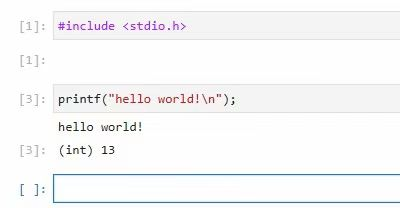

## Intro

This repo has only one `dockerfile` and cling. the `dockerfile` can build a image which can writing `c/cpp` like writing `python`.


## What's cling?

cling is a c/cpp interpreter. We can run c/cpp files with out compile.


## Env

Docker for Windows

wsl2(ubuntu 2004)


## Runtime

Image Size : 2.4GB 😨


### Start 

```
$docker logs <container name>
........
........
........
........
To access the server, open this file in a browser:
        file:///root/.local/share/jupyter/runtime/jpserver-7-open.html
    Or copy and paste one of these URLs:
        http://localhost:8888/lab?token=tokens
        http://127.0.0.1:8888/lab?token=tokens
```

click links enter jupyterlab 

over....

enjoy it:



## Reference

[root-project/cling: The cling C++ interpreter (github.com)](https://github.com/root-project/cling)


## Plan

cut some component